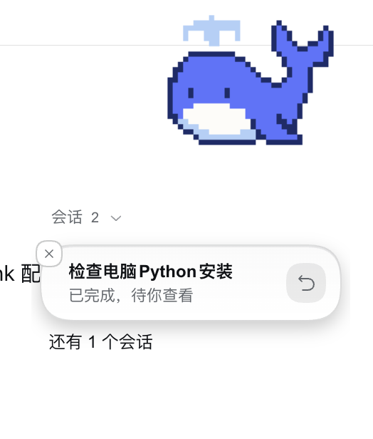

<div align="center">

# dsh-pet-whale

**A pixel blue-whale companion for DeepSeek Harness tasks**

[简体中文](README.zh-CN.md) · [Apache-2.0](LICENSE) · [Feature guide](docs/FEATURES.md) · [Companion API](docs/companion-api.md)

[](LICENSE)
[](https://nodejs.org/)

</div>

<p align="center">
  
</p>

**dsh-pet-whale** is an independent in-page pet plugin for [DeepSeek Harness](https://github.com/deepseek-ai/deepseek-harness) (DSH). A pixel-style blue whale lives in the corner of the page while you work, keeps an eye on every task, and swims to you when something needs your attention.

It started as a fork of [`@michengai/dsh-codex-pet`](https://github.com/MichengAI/dsh-codex-pet) (via the `dsh-bluewhale-pet` fork) and is now developed as its own plugin — see [FORK.md](FORK.md) for the full lineage and everything that changed.

## Features

- **In-page companion**: a blue whale stays in the corner of the DSH page while you work.
- **Tasks at a glance**: running, waiting-for-you, failed, and completed tasks become notification bubbles; when everything is quiet, so is the whale.
- **Act from the bubble**: open the conversation, stop the current turn, or answer approval / question / plan requests without leaving your current view.
- **Head-pat interaction**: single-click the whale and it squashes happily while hearts float up (double-click to make it jump, drag to move it, right-click for the menu).
- **Full-screen roaming**: while a task runs, the whale wanders the whole page along smooth arcs and swims back to its spot when the task ends (toggle + speed in settings).
- **Keyboard & a11y friendly**: labelled controls, focus rings, and full support for `prefers-reduced-motion`.
- **Custom pets**: drop your own Codex-protocol spritesheets into `~/.dsh/pet-whale/pets`, or generate new pets in DSH with the bundled skill.
- **Scriptable**: the `window.dshPetWhale` companion API lets scripts observe task state and drive every action — see [docs/companion-api.md](docs/companion-api.md).

## Installation

dsh-pet-whale is a personal plugin and is **not published to npm**. Install it into a DSH profile as a **`link:` local dependency**:

1. Clone or copy this repository somewhere permanent, e.g. `~/dsh-plugins/dsh-pet-whale`.
2. Reference it in your DSH profile's `package.json`:

   ```json
   {
     "dependencies": {
       "dsh-pet-whale": "link:/absolute/path/dsh-pet-whale"
     },
     "dsh": {
       "profile": {
         "bundles": ["...", "dsh-pet-whale"]
       }
     }
   }
   ```

3. Run `pnpm install --offline` in the profile directory (or let DSH install on boot).
4. If DSH's version-compatibility check blocks the plugin, grant an exact-version exemption (adjust versions to yours):

   ```bash
   dsh plugin --profile desktop allow-version dsh-pet-whale@1.0.0 --dsh-version 0.2.0-rc.2 --accept-risk
   ```

5. Restart DSH, then open **Settings → Pets**.

## Usage

| Goal | Action |
| --- | --- |
| Move / play | Drag to move; single-click to pat; double-click to jump. |
| Read task updates | Read the notification bubbles; expand the list when several tasks need attention. |
| Continue a conversation | Click a bubble to open the corresponding DSH task. |
| Handle a request | Expand the request inside the bubble and answer it inline. |
| Stop a turn | Click the stop control on a running task's bubble. |
| Configure | Right-click the pet → Pet settings, or Settings → Pets. |

### Data & pets

All data lives outside the package in `~/.dsh/pet-whale/` (`config.json` + `pets/`), so updating or reinstalling the plugin never touches your pets or settings.

## Development

```bash
node --check lib/index.js && node --check lib/client.js   # syntax
node test-host.mjs    # host-side HTTP + config round-trip (uses a throwaway data dir)
node test-roam.mjs    # roaming engine, sliced from the real client bundle
```

`lib/*.js` are esbuild artifacts edited directly; see [FORK.md](FORK.md) for the layout and the three places the plugin name must stay in sync.

## License

Licensed under the [Apache License 2.0](LICENSE). See [NOTICE](NOTICE) for upstream attribution and the list of changes versus the original plugin.
