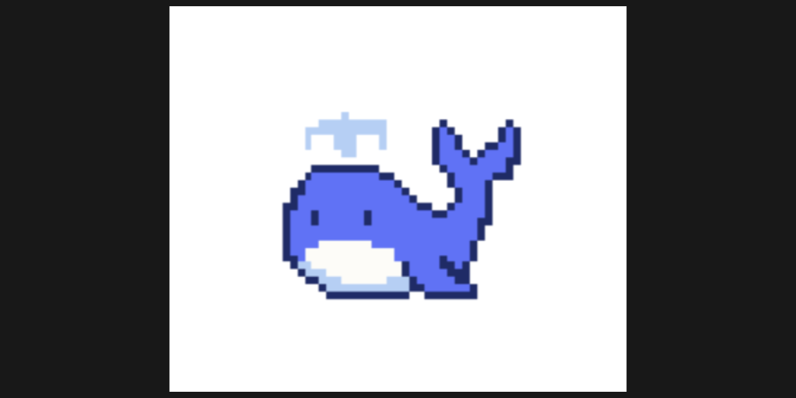
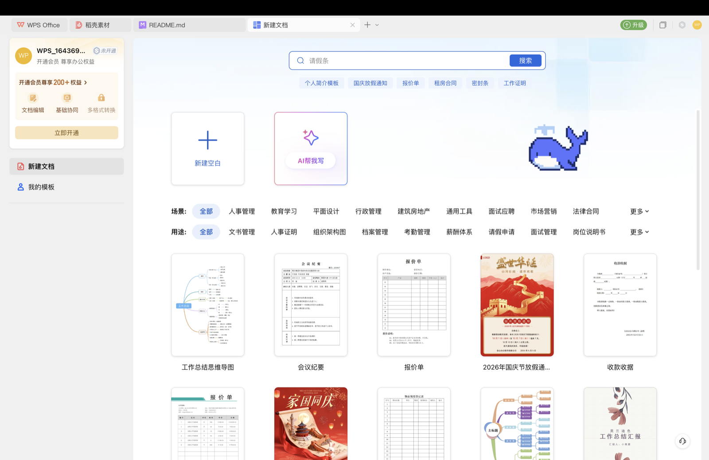

<div align="center">



# dsh-pet-whale

**一只陪你干活的像素蓝鲸，住在 DeepSeek Harness 里，也能游满整个桌面。**

[English](README.md) · [功能全览](docs/FEATURES.md) · [Companion API](docs/companion-api.md) · [Apache-2.0](LICENSE)

  

</div>

<!-- 首屏动图：悬浮模式，鲸鱼横渡屏幕、水帘垂到底部 -->


---

## 这是什么

一个 DeepSeek Harness（DSH）桌宠插件。工作时它待在角落替你盯着任务：跑起来了它会巡游，出错会发抖冒火，要你审批会蹦跳提醒，完成了会顶着一条通到页底的水柱横渡整屏庆祝。

它有两种形态：**住在 DSH 页面里**，或者**悬浮在整台电脑的一切窗口之上**（任意应用、任意全屏 Space，鲸鱼之外全部鼠标穿透）。

## ✨ 亮点

- 🖥️ **桌面悬浮模式** —— 用 DSH 自带的运行时开出全屏透明置顶窗口，鲸鱼真正出圈
- 🔔 **任务提醒** —— 运行中 / 等待审批 / 出错 / 完成，四种状态四种表现，审批和提问直接在气泡里处理
- 🎭 **情绪反应** —— 失败抖动冒火、等待蹦跳、完成时全屏水帘庆祝
- 🚿 **摇晃喷水** —— 抓住鲸鱼甩一甩，像素水帘从天而降、在屏幕底堆积摊平化光
- 🎲 **摸头盲盒** —— 单击摸摸头，50% 冒爱心、50% 喷一股水
- 🗺️ **自动巡航** —— 不定期离家溜达一圈，频率可调
- 🧩 **可编程** —— `window.dshPetWhale` 脚本接口，任务状态和全部操作开放

完整功能与参数见 **[功能全览](docs/FEATURES.md)**。

## 🖼️ 更多实拍

<!-- 依次：悬浮鲸全屏 / 任务通知与审批 / 摸头盲盒 / 自动巡航 / 设置页 -->
| | |
| --- | --- |
|  |  |
|  |  |

## 📦 安装

1. 克隆本仓库到固定位置：
   ```bash
   git clone https://github.com/15372010668-dot/dsh-pet-whale.git ~/dsh-plugins/dsh-pet-whale
   ```
2. 在 DSH profile 的 `package.json` 中引用：
   ```json
   {
     "dependencies": { "dsh-pet-whale": "link:~/dsh-plugins/dsh-pet-whale" },
     "dsh": { "profile": { "bundles": ["...", "dsh-pet-whale"] } }
   }
   ```
3. 在 profile 目录执行 `pnpm install --offline`，重启 DSH；
4. ⚠️ **若被 DSH 版本校验静默拦截**（装了没反应），需按 manifest 授一次豁免：
   ```bash
   dsh plugin --profile desktop allow-version dsh-pet-whale@1.2.0 --dsh-version <你的DSH版本> --accept-risk
   ```

> 目前仅支持 macOS（悬浮模式依赖 DSH 自带的 Electron 运行时）。数据目录在 `~/.dsh/pet-whale/`，卸载不丢宠物。

## 🎮 交互

| 动作 | 反应 |
| --- | --- |
| 单击 | 摸头：挥手压扁，50% 爱心 / 50% 喷水 |
| 双击 | 跳跃 |
| 拖动 | 移动位置（自动记忆）；摇晃会喷水 |
| 右键 | 菜单：设置、收起、恢复通知等 |

## 🛠 开发

```bash
npm run check   # 语法检查（4 个入口文件）
npm test        # 69 项自动化测试：宿主 HTTP / 漫游引擎 / 通知状态机
npm run sync    # 同步到本地 DSH 插件目录
```

`lib/*.js` 为直接维护的 esbuild 产物，架构与血统说明见 [FORK.md](FORK.md)。

## 📜 License

[Apache-2.0](LICENSE)。本项目是 [@michengai/dsh-codex-pet](https://github.com/MichengAI/dsh-codex-pet) 的衍生作品，上游署名与第三方素材声明见 [NOTICE](NOTICE)。
